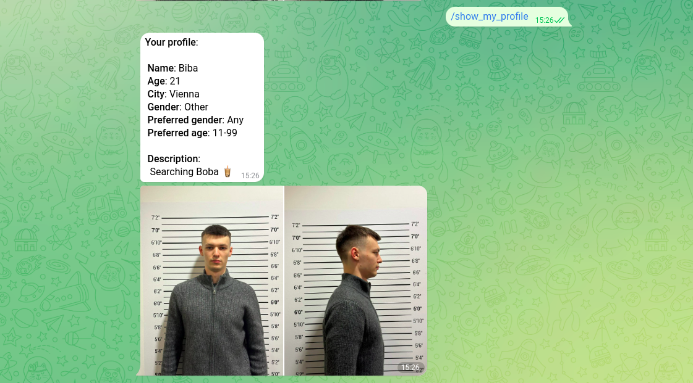
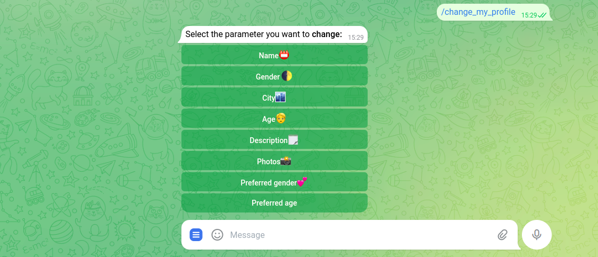

# Matchi
 Telegram: @match_botbot

 [Matchi_link](https://web.telegram.org/a/#5397155789)
## Description 
It is a Telegram dating bot, where you can find interesting people. 
It looks nice and works simply. Flexible profile settings makes 
searching suitable for your people much easier.

## Installation
1. Clone repository:
    ```
    git clone https://github.com/shatentor/matchi.git
    cd vpn_bot
    ```
   
2. Install requirements:
    ```
    pip install -r requirements.txt
    ```
3. Update file "config.py" with your token Telegram API.
4. I use MariaDB to store all data. To install:
   ```
   sudo apt install mariadb-server
   sudo systemctl start mariadb
   sudo systemctl enable mariadb
   ```  
   Now you need to create template of tables that I use. 
   You can find SQl requests in [sql_templates](readme_stuff/sql_templates).

5. Update [db_connect_users](data_base/db_connect_users.py) with your data.

## Usage
Some examples of commands:
   ### Show My Profile: 
   
   ### Change My Profile: 

   ### My Mutual Likes: 


## LICENSE
This project licenced by Apache License Version 2.0 - look file [LICENSE](LICENSE).
## Contribution 
Contributions to the project are welcome! 
Feel free to report bugs or suggest improvements. Collaboration with other developers or 
receiving advice is also appreciated.

## Contact 
You can reach me via email at shatentor66@gamil.com.
## Project Status 
This project is currently under development.