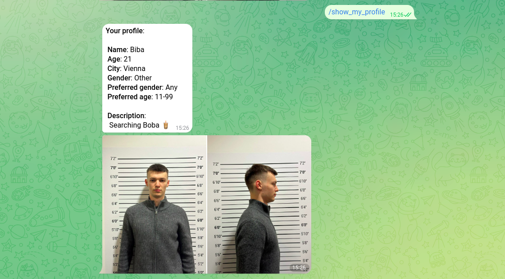
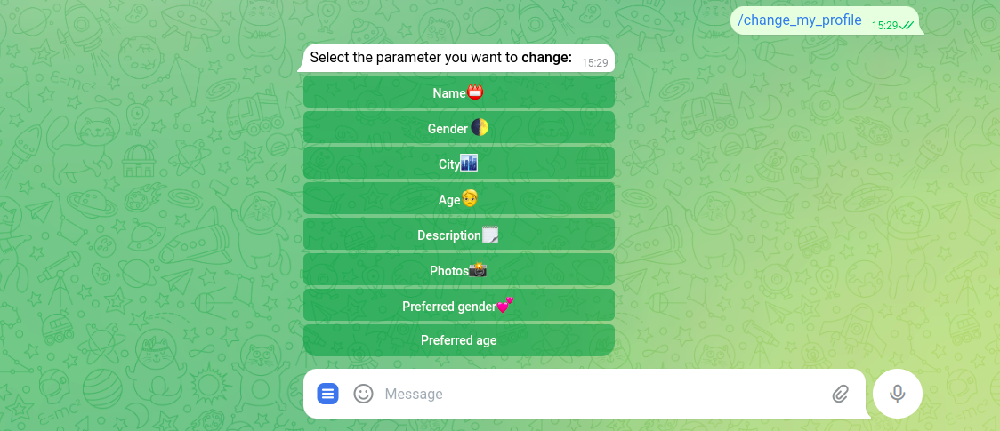
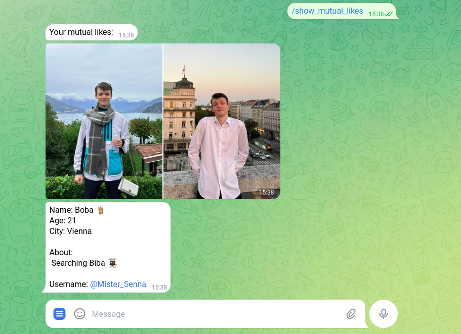

# Matchi
 Telegram: @match_botbot

 [Matchi_link](https://web.telegram.org/a/#5397155789)
## Description
It is a Telegram dating bot, where you can find interesting people.
It looks nice and works simply. Flexible profile settings makes
searching suitable for your people much easier.

## Installation
1. Clone repository:
    ```bash
    git clone https://github.com/shatentor/matchi.git
    cd matchi
    ```
   
2. Install requirements:
    ```bash
    pip install -r requirements.txt
    ```
3. Create a `.env` file in the root directory and add your Telegram Bot API token, PostgreSQL credentials, and admin IDs:
    ```
    BOT_TOKEN=YOUR_TELEGRAM_BOT_TOKEN
    DB_USER=your_pgsql_user
    DB_PASSWORD=your_pgsql_password
    DB_HOST=localhost
    DB_PORT=5432
    DB_NAME=match_bot
    ADMIN_IDS=YOUR_ADMIN_TELEGRAM_ID_1,YOUR_ADMIN_TELEGRAM_ID_2 # Comma-separated without spaces
    ```
   
4. Install PostgreSQL and create your database.
    *   **PostgreSQL Installation:** Follow instructions for your OS (e.g., `sudo apt install postgresql` for Debian/Ubuntu, `brew install postgresql` for macOS, or download from [postgresql.org/download/windows](https://www.postgresql.org/download/windows/)).
    *   **Create User and Database:**
        ```bash
        # As postgres user (e.g., sudo -i -u postgres)
        psql
        CREATE DATABASE match_bot;
        CREATE USER your_pgsql_user WITH PASSWORD 'your_pgsql_password';
        GRANT ALL PRIVILEGES ON DATABASE match_bot TO your_pgsql_user;
        \q
        ```
   
5. Create tables in your PostgreSQL database.
   You can find SQL requests in [db/sql_templates.sql](db/sql_templates.sql).
   **Make sure to run the updated SQL queries to create the new table structure!**
   ```bash
   # As postgres user, then in psql:
   psql -d match_bot -U your_pgsql_user
   \i /path/to/your/project/db/sql_templates.sql
   \q
   ```

## Usage
To run the bot:
```bash
python main.py
```
Some examples of commands:
   ### Show My Profile: 
   
   ### Change My Profile: 

   ### My Mutual Likes: 


## LICENSE
This project licenced by Apache License Version 2.0 - look file [LICENSE](LICENSE).
## Contribution
Contributions to the project are welcome!
Feel free to report bugs or suggest improvements. Collaboration with other developers or
receiving advice is also appreciated.

## Contact
You can reach me via email at shatentor66@gamil.com.
## Project Status
This project is currently under development.
